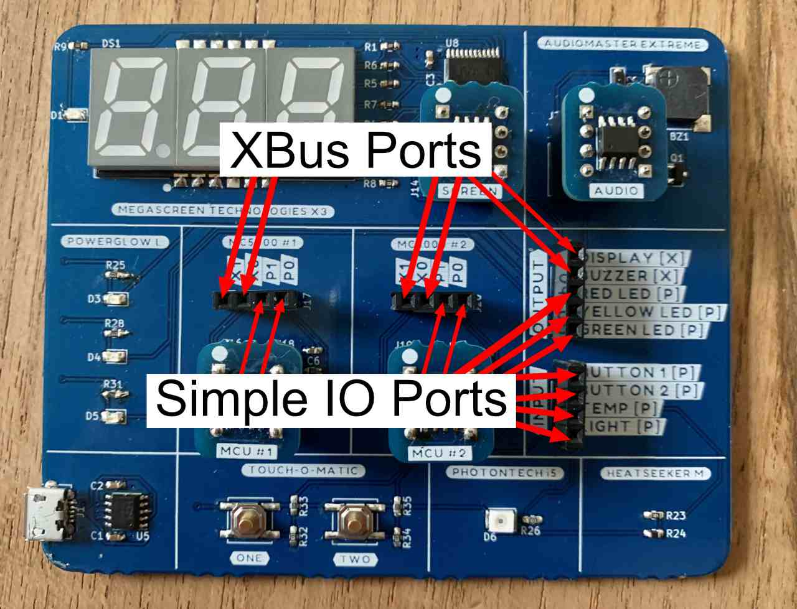

[<< back](index)

# Making connections

## Ports

The MC5000 DevKit has 2 different types of ports (or pins) that can be connected. Simple I/O and XBus.
The 2 MC5000 controllers in the middle have each 2 XBus ports (X0 and X1) and 2 Simple I/O ports (P0 and P1).
They can all be used as data inputs or data outputs.

- A Simple I/O port can be set or read from at any time. The value of a Simple I/O port can be set to a value between 0 and 100.
- The XBus port can only be written to if another XBus port is listening to it. It can be set to value between -999 and 999.

The "Megascreen Technologies X3" display and the "Audiomaster Extreme" are XBus input devices. They are always listening. 
The other inputs and outputs are Simple I/O devices. You use the supplied jumper cables to connect the ports.

*Only connect Simple I/O to Simple I/O and XBus to XBus ports*

## Try it out

Connect the DevKit to yout computer via USB. Connect the "RED LED" output to the "Button 1" input. 
If you press "Button 1" the red LED lights up. Try it with the other button and the other LEDs.

Now it's time to write some [assembler code](assembler)