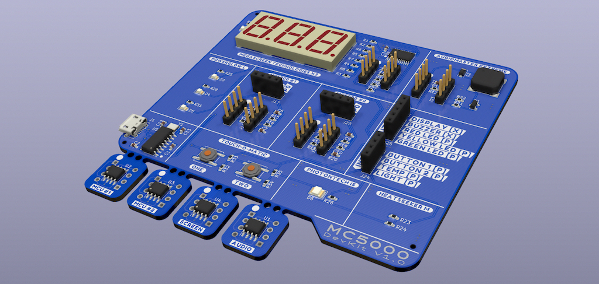

You need a circuit board like this to play:

## Intructions

[Installing the desktop app](install)

[Making connections on the board](connections)

[The assembler language](assembler)

## Levels

[Level 1](level1)

[Level 2](level2)

[Level 3](level3)

[Level 4](level4)

[Level 5](level5)

[Level 6](level6)