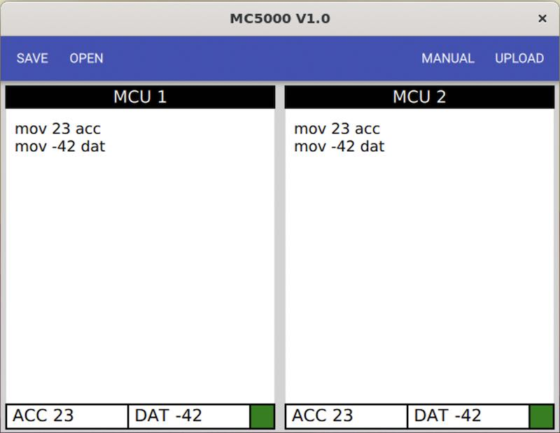

[<< back](index)

# Install the desktop app

Go to the [release page](https://github.com/RickP/MC5000_DevKit/releases) and download the latest package for your platform.

See instruction for your operating system below.

## Linux

There are AppImge packages for 64bit Intel systems (x86_64) and 64bit ARM (arm64). If you have a Raspberry Pi use the Arm64 one. You need the 64 bit Raspian installed on a Pi3 or Pi4 from [here](http://downloads.raspberrypi.org/raspios_arm64/images/).

The AppImage needs to be made executable after download. [This](https://docs.appimage.org/introduction/quickstart.html#ref-quickstart) explains how to do it.

The App should run on any recent Linux (Ubuntu 18.04 and up) without any drivers.

## MacOS

Just download the dmg and move the app to your Applications directory. Click on it to start. MacOS Catalina and up have the USB driver included. It's intel only but runs just fine on an M1 Mac.

## Windows

Download the zip file and unpack it to your disk. 

Unfortunately you have to install drivers for the USB->Serial chip on windows. Get them from [here](http://www.wch-ic.com/downloads/CH341SER_EXE.html) and install them. Then connect the board via USB and run the MC5000.exe in the folder. 

You may have to install the C++ runtime "vc_redist.x64.exe" in the folder if it complains about something missing - but chances are high that you already have this.

# Usage

When the app opens up you may have to choose the correct USB port. If you're not sure unplug the board, click refresh, plug it in, click refresh and choose the one that was added to the list.

The user interface is pretty simple. You can load and save code to a text file. The button 'Manual' is just a link to this document. "Upload" writes the code you entered to the board.

Now [connect some wires](connections)